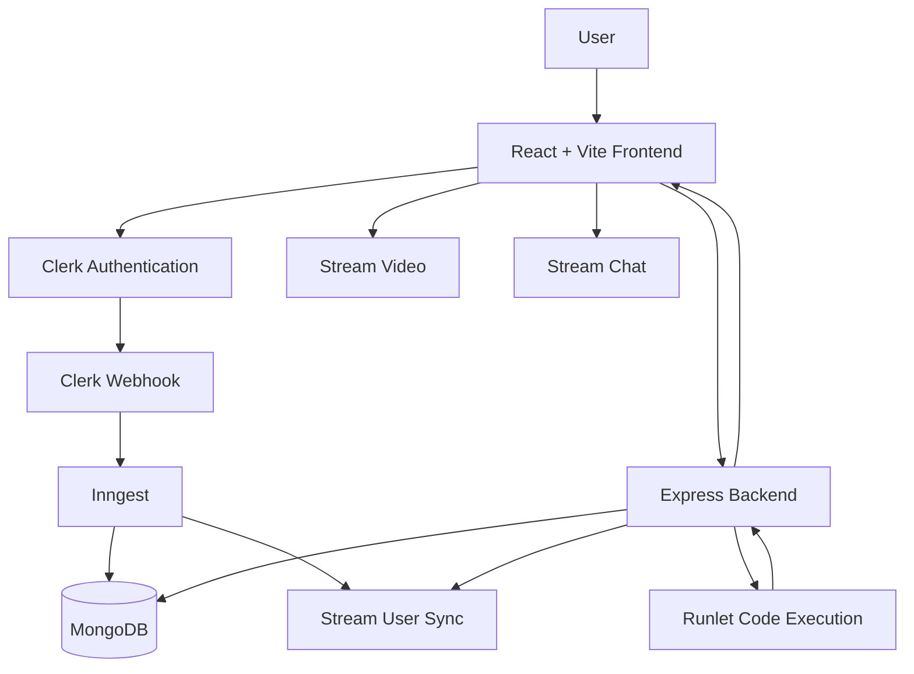

# Remote Interview Platform

A full-stack technical interview platform that allows users to create and join interview sessions, solve coding problems, execute code against test cases, communicate through video and chat, and manage interview sessions from a dashboard.

## Features

- 🔐 Authentication using Clerk
- 🎥 Real-time video interviews using Stream Video
- 💬 Real-time chat using Stream Chat
- 💻 Integrated coding workspace
- ▶️ Server-side code execution using Runlet
- 🧪 Automatic test-case execution
- 📝 Built-in coding problems
- 🌐 Multiple programming languages
  - JavaScript
  - Python
  - Java
  - C++
- 📊 Dashboard for active and recent sessions
- ➕ Create interview sessions
- 🔗 Join existing interview sessions
- 🛑 End interview sessions
- 👤 User synchronization using Clerk Webhooks and Inngest
- 📱 Responsive React interface

---

## How It Works

1. A user signs in using **Clerk**.
2. The user can browse available coding problems.
3. An interview session can be created from the dashboard.
4. Another user can join the active session.
5. Participants communicate using **Stream Video** and **Stream Chat**.
6. The coding workspace provides starter code for the selected problem.
7. Code is sent to the backend for execution.
8. The backend executes the code using **Runlet**.
9. The result is evaluated against the problem's test cases.
10. The session can be ended and later appears in recent sessions.

---

## Tech Stack

### Frontend

- React
- Vite
- React Router
- Tailwind CSS
- DaisyUI
- Clerk
- Stream Video React SDK
- Stream Chat React
- Monaco Editor
- TanStack Query
- Axios
- Lucide React

### Backend

- Node.js
- Express.js
- MongoDB
- Mongoose
- Clerk Express
- Stream Node SDK
- Stream Chat
- Inngest
- Axios
- CORS
- dotenv

### External Services

- **Clerk** — Authentication and user management
- **MongoDB** — Database
- **Stream** — Video calls and chat
- **Inngest** — Background event processing
- **Runlet** — Code execution
- **Render** — Deployment

---

## Architecture



---

## Project Structure

```text
Remote-Interview-Platform/
│
├── backend/
│   ├── src/
│   │   ├── controllers/
│   │   │   ├── chatController.js
│   │   │   └── sessionController.js
│   │   │
│   │   ├── data/
│   │   │   └── problems.js
│   │   │
│   │   ├── lib/
│   │   │   ├── db.js
│   │   │   ├── env.js
│   │   │   ├── inngest.js
│   │   │   └── stream.js
│   │   │
│   │   ├── middleware/
│   │   │   └── protectRoute.js
│   │   │
│   │   ├── models/
│   │   │   ├── Session.js
│   │   │   └── User.js
│   │   │
│   │   ├── routes/
│   │   │   ├── chatRoutes.js
│   │   │   ├── clerkWebhook.js
│   │   │   └── sessionRoutes.js
│   │   │
│   │   └── server.js
│   │
│   └── package.json
│
├── frontend/
│   ├── public/
│   │
│   ├── src/
│   │   ├── api/
│   │   ├── components/
│   │   ├── constants/
│   │   ├── hooks/
│   │   ├── lib/
│   │   ├── pages/
│   │   ├── App.jsx
│   │   ├── App.css
│   │   ├── index.css
│   │   └── main.jsx
│   │
│   ├── package.json
│   └── vite.config.js
│
├── .gitignore
├── package.json
├── Project_REPORT.md
└── README.md
```

---

## Prerequisites

Before running the project locally, install:

- Node.js
- npm
- MongoDB database or MongoDB Atlas account

You will also need accounts/configuration for:

- Clerk
- Stream
- Inngest

---

## Installation

### 1. Clone the repository

```bash
git clone https://github.com/thetanishnagpal/Remote-Interview-Platform.git
cd Remote-Interview-Platform
```

### 2. Install backend dependencies

```bash
cd backend
npm install
```

### 3. Install frontend dependencies

```bash
cd ../frontend
npm install
```

---

## Environment Variables

Create the required environment files before starting the application.

### Backend

Create a `.env` file inside the `backend` directory.

```env
PORT=8080
DB_URL=your_mongodb_connection_string
NODE_ENV=development
CLIENT_URL=http://localhost:5173

INNGEST_EVENT_KEY=your_inngest_event_key
INNGEST_SIGNING_KEY=your_inngest_signing_key

STREAM_API_KEY=your_stream_api_key
STREAM_API_SECRET=your_stream_api_secret

CLERK_SECRET_KEY=your_clerk_secret_key
```

> Never commit `.env` files or API secrets to GitHub.

### Frontend

Create a `.env` file inside the `frontend` directory.

```env
VITE_CLERK_PUBLISHABLE_KEY=your_clerk_publishable_key
VITE_API_URL=http://localhost:8080/api
VITE_STREAM_API_KEY=your_stream_api_key
```

---

## Running Locally

### Start the backend

From the `backend` directory:

```bash
npm run dev
```

The backend runs on:

```text
http://localhost:8080
```

### Start the frontend

Open another terminal and run:

```bash
cd frontend
npm run dev
```

Vite will start the frontend development server.

Typically:

```text
http://localhost:5173
```

---

## Available Scripts

### Root

Build the entire project:

```bash
npm run build
```

Start the backend:

```bash
npm start
```

### Backend

Development server:

```bash
npm run dev
```

Production server:

```bash
npm start
```

### Frontend

Development server:

```bash
npm run dev
```

Production build:

```bash
npm run build
```

Run ESLint:

```bash
npm run lint
```

Preview production build:

```bash
npm run preview
```

---

## API Overview

### Problems

```http
GET /api/problems
```

Returns the available coding problems.

```http
GET /api/problems/:id
```

Returns a specific coding problem.

---

### Code Execution

```http
POST /api/execute
```

Example request:

```json
{
  "language": "javascript",
  "code": "console.log('Hello World')",
  "problemId": "problem-id"
}
```

The backend sends the code for execution and evaluates the result against the selected problem's test cases.

---

### Sessions

Get active sessions:

```http
GET /api/sessions/active
```

Create a session:

```http
POST /api/sessions
```

Get the authenticated user's recent sessions:

```http
GET /api/sessions/my-recent
```

Get a session:

```http
GET /api/sessions/:id
```

Join a session:

```http
POST /api/sessions/:id/join
```

End a session:

```http
POST /api/sessions/:id/end
```

---

### Chat

Get a Stream user token:

```http
GET /api/chat/token
```

---

### Webhooks

Clerk webhook endpoint:

```http
POST /api/webhooks/clerk
```

The webhook is used to synchronize Clerk user events with the application.

---

### Inngest

```http
/api/inngest
```

Used by Inngest for background event processing.

---

### Health Check

```http
GET /health
```

Used to verify that the backend server is running.

---

## Authentication

Authentication is handled using **Clerk**.

Protected backend routes use Clerk middleware to identify the authenticated user.

The application also maintains its own MongoDB user records. Clerk user events are sent through the webhook endpoint and processed using Inngest.

This keeps the application's user data synchronized with Clerk.

---

## Database

The project uses **MongoDB** with **Mongoose**.

### User

User records contain information such as:

- Name
- Email
- Profile image
- Clerk user ID

### Session

Session records store interview-related information including:

- Host
- Participant
- Coding problem
- Problem ID
- Difficulty
- Stream call ID
- Session status

---

## Coding Problems

Coding problems are defined in:

```text
backend/src/data/problems.js
```

The project currently includes problems such as:

- Two Sum
- Reverse String
- Valid Palindrome
- Maximum Subarray
- Contains Duplicate
- Climbing Stairs

Each problem can contain:

- Description
- Difficulty
- Examples
- Constraints
- Starter code
- Language-specific code
- Test runner

The test runner is kept on the backend and is not included in the public problem response.

---

## Code Execution

Code execution is handled by the backend through **Runlet**.

The basic flow is:

```text
Code Editor
     ↓
React Frontend
     ↓
POST /api/execute
     ↓
Express Backend
     ↓
Problem Test Runner
     ↓
Runlet
     ↓
Execution Result
     ↓
Backend Evaluation
     ↓
Frontend Output Panel
```

This keeps test execution logic on the backend rather than exposing it directly to the frontend.

---

## Video and Chat

The platform integrates **Stream** for communication during interview sessions.

### Video

Stream Video is used for interview calls.

Each interview session is associated with a Stream call ID.

### Chat

Stream Chat provides messaging functionality for participants in an interview session.

Stream user tokens are generated by the backend rather than exposing secret credentials to the frontend.

---

## Deployment

The application is deployed using **Render**.

### Frontend

[Remote Interview Platform](https://remote-interview-platform-1-xh21.onrender.com)

### Backend

[Backend API](https://remote-interview-platform-z47o.onrender.com)

### Health Check

[Backend Health](https://remote-interview-platform-z47o.onrender.com/health)

Production environment variables should be configured through the deployment platform rather than committed to the repository.

---

## Screenshots

Screenshots and demo images can be added here to showcase:

- Landing page
- Dashboard
- Problem browser
- Interview session
- Code execution results
- Video and chat interface

---

## Current Limitations

The coding workspace provides the interview coding environment, but the current implementation does **not** synchronize editor contents between participants in real time.

Real-time collaborative code editing could be added in a future version using technologies such as WebSockets or a shared document synchronization system.

---

## Future Improvements

Potential improvements documented for the project include:

- Real-time collaborative code editing
- Shared API contracts
- Standardized API response formats
- Stronger webhook verification and idempotency
- Integration testing
- Structured logging and tracing
- More robust retry and failure handling
- Queue-based code execution
- Role-based authorization
- Improved session state synchronization

---

## Security

Sensitive values such as:

- Database credentials
- Clerk secrets
- Stream secrets
- Inngest credentials

should always be stored in environment variables.

Do not commit `.env` files, tokens, API keys, or database credentials to the repository.

---

## Repository

GitHub:

```text
https://github.com/thetanishnagpal/Remote-Interview-Platform
```

---

## Author

**Tanish Nagpal**

GitHub: [@thetanishnagpal](https://github.com/thetanishnagpal)

---

## License

The root `package.json` currently declares the project license as:

```text
ISC
```

If you intend to distribute the project under the ISC License, consider adding a standalone `LICENSE` file to the repository.
